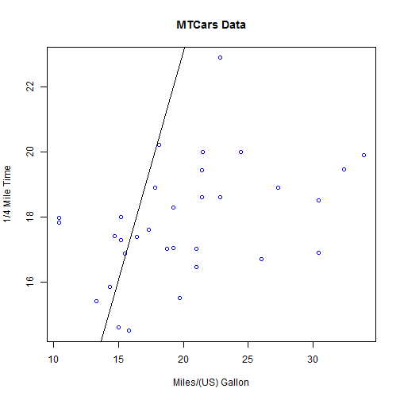

Developing Data Products - Final Project
========================================================
author: Ken Koch
date: March 25, 2017
autosize: true
css: DDP-Final.css

Background
========================================================
incremental: true

 
Our client, Street and Dragstrip magazine, wanted to have an
application built that would allow its readers to quickly
and easily determine relationships between cars.
   

Introducing: The Car Data Calculator!

About the Data
========================================================

The data was taken from the MTCars dataset and includes the following variables:

<table width="100%" style="border-style: hidden; margin-left: 40px">
        <tr>
                <td style="border-style: hidden; vertical-align: top;">
                        <ul>
                                <li>Miles/(US) Gallon</li>
                                <li>Number of Cylinders</li>
                                <li>Displacement (cu.in.)</li>
                                <li>Gross Horsepower</li>
                                <li>Rear Axle Ratio</li>
                                <li>Weight (1000 lbs)</li>
                        </ul>
                </td>
                <td style="border-style: hidden; vertical-align: top">
                        <ul>
                                <li>1/4 Mile Time</li>
                                <li>V or Straight Engine</li>
                                <li>Transmission (0 = automatic, 1 = manual)</li>
                                <li>Number of Forward Gears</li>
                                <li>Number of Carburetors</li>
                        </ul>
                </td>
        </tr>
</table>

Sample Output from the Car Data Calculator Application
========================================================
 
* User selects:
     + "mpg" for the X-Axis variable
     + "qsec" for the Y-Axis variable
  
* and Viola! The app produces a chart similar to the chart shown here

***

Accessing the Application and Source Code
========================================================
 
Choose one of the links below to access the application and source code for this project
   
[Car Data Calculator Shiny App](https://kkoch3.shinyapps.io/DDP-FinalProject/)
  
[Source Code for this Presentation]()
  
[Source Code for the Shiny App]()
